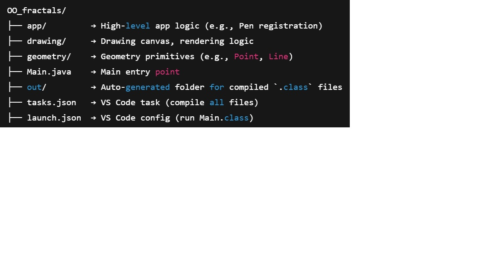
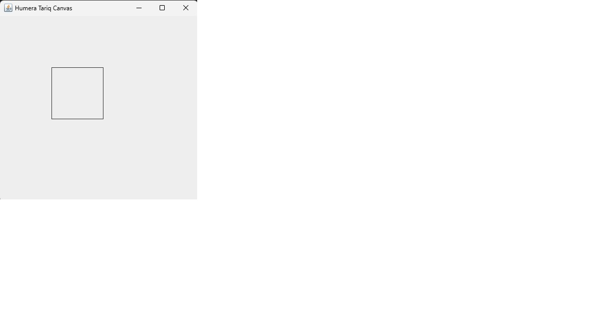

# Java Fractals Project 
Java OOP: Fractals with Point & Pen (OO-Fractals)

📁 Project Structure overview

How to Compile and Run in VS Code
=================================

One-time Setup (Already Done)
--------------------------------
We created:

- `tasks.json`: To compile all Java files into the `out` folder.
- `launch.json`: To run `Main.class` from the `out` folder.

No need to edit these files now — they are available inside the `.vscode/` folder in the repo.

🧪 How to Compile
-----------------
Use this shortcut:

- `Ctrl + Shift + B` → Runs the **"Compile All"** task

This compiles:

- `Main.java`
- All `.java` files in `app/`, `drawing/`, and `geometry/`

✅ After this, check the `out/` folder — it should now contain `.class` files organized into subfolders.

▶️ How to Run
-------------
- Press `Ctrl + Shift + P` → Type `Run`, then select **"Run: Launch Main"**

OR

- Just click the green ▶️ **Run** button in the top-right corner of VS Code.

This will launch the program using the compiled `Main.class` from the `out/` folder.
