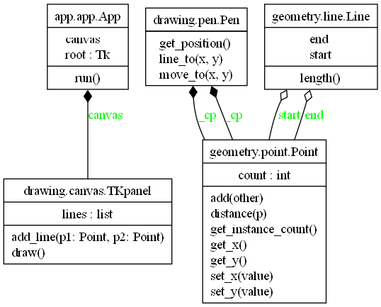

# Python Fractals Project 
- `geometry/`: Contains the fundamental geometric classes (`Point`, `Line`).
- `drawing/`: Responsible for rendering (custom canvas + pen logic).
- `app/`: Application control flow.
- `main.py`: Starts the GUI and application.

## 🐍 Python Setup

### ✅ Prerequisites
- Python 3.10+
- VS Code (recommended)
- Git (recommended)

### 📌 UML Class Diagram



### 🔧 Create and Activate Virtual Environment

To keep your project clean and portable, it's **recommended to create the virtual environment inside your project folder.**

#### ✅ Step-by-Step Guide

This will create a venv/ folder inside your project. 
1. **Open VS Code Terminal** inside your Python project folder (recommended):
   - In VS Code: Right-click your `python/` folder → `Open in Integrated Terminal`
   - Or use the shortcut: `` Ctrl + ` ``

2. **Create `venv`** (only once):
   ```sh
   python -m venv venv

3. **Activate `venv`**:
   Use VS Code's interpreter feature: 
   - Press `Ctrl+Shift+P` → select **"Python: Select Interpreter"**
   - Choose the one ending in:
     ```
     .../venv/Scripts/python.exe
     ```
---

### 📦 Install Required Packages

You can install any required packages like this:

✅ Step-by-Step Guide
Open VS Code Terminal inside your project folder:

Right-click your folder → Open in Integrated Terminal Or use the shortcut: Ctrl + `

Install a required package (example: for UML or plotting):
```sh
pip install matplotlib         # For plotting
pip install pylint             # For linting
pip install plantuml           # For UML diagram generation
```
---
### 📦 save  Installed Packages
✅ requirements.txt (Standard for most Python projects)
Purpose: Lists installed packages and their exact versions.
```sh
pip freeze > requirements.txt
```
For some other project usage:
```sh
pip install -r requirements.txt
```
---

# Activate virtual environment by typing: venv\Scripts\activate

- To generate UML diagrams for this project, follow the steps below:
- Please open the terminal manually inside VS Code by:
- Going to Menu → Terminal → New Terminal or using shortcut: `Ctrl + `` (backtick)
- Run power shell command to set execution policy if you encounter an error:
- PS D:\week03_OOPs_Point_Pen\OO_fractals> Set-ExecutionPolicy -Scope CurrentUser -ExecutionPolicy RemoteSigned
- Activate venv: PS D:\week03_OOPs_Point_Pen\OO_fractals> .\venv\Scripts\Activate.ps1

- Just make sure your VS Code is using the correct interpreter:
- Press Ctrl+Shift+P → "Python: Select Interpreter"
- Choose the one that looks like:.\venv\Scripts\python.exe
- This make ease running the script via the "Run" button or python -u command in VS Code's internal runner, not from an activated terminal session or cmd.

# Confirm where python in VSCode points to:
- D:\week03_OOPs_Point_Pen\OO_fractals> python -c "import sys; print(sys.executable)"
- It must say D:\week03_OOPs_Point_Pen\OO_fractals\venv\Scripts\python.exe

# To check and verify the installed packages in the virtual environment:
- (venv) PS D:\week03_OOPs_Point_Pen\OO_fractals\python> cd ..
- (venv) PS D:\week03_OOPs_Point_Pen\OO_fractals> dir .\venv\Scripts\pyreverse*

### 🧩 Generate UML Class Diagrams using Pyreverse
- Make sure you have Graphviz installed and added to your PATH.
- (venv) PS D:\week03_OOPs_Point_Pen\OO_fractals> cd D:\week03_OOPs_Point_Pen\OO_fractals\python
- (venv) PS D:\week03_OOPs_Point_Pen\OO_fractals>python -m pip install pylint
- (venv) PS D:\week03_OOPs_Point_Pen\OO_fractals\python> ..\venv\Scripts\pyreverse.exe -o png -p OO_fractals -my geometry drawing app
- Format png is not supported natively. Pyreverse will try to generate it using Graphviz...
- Analysed 6 modules with a total of 4 imports